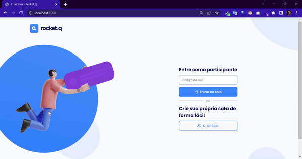

# :purple_heart: Projeto

  RocketQ é um WebApp desenvolvido na 6ª semana da NLW com o objetivo de criar salas de bate-papo onde outras pessoas possam fazer perguntas anônimas.
  
  
  
##  :rocket: Demonstração

 

    

 

##  :computer:  Tecnologias 

- HTML

- CSS

- JavaScript

- NodeJs

- EJS

- Express

- SQL 

  

##

Feito por mim com :purple_heart: junto com a Rocketseat :rocket: 

